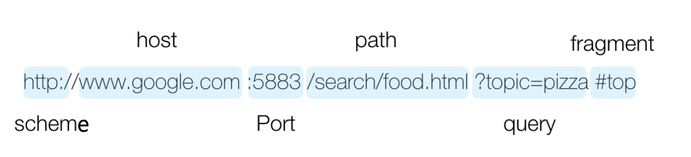

# 웹의 3 요소

## HTML (`HyperText Markup Language`)

- 정보의 표현
- 태그 이용하여 표현

## HTTP (`HyperText Transfer Protocol`)

- 웹에서 데이터를 주고받는 서버-클라이언트 모델의 프로토콜
- 인터넷의 프로토콜 중의 하나 (TCP, IP, FPT, Telnet)

## URL (`Uniform Resource Locator`)



- 인터넷의 자원을 표시하는 통일된 방식
- Scheme: 접근 방법. HTTP/FTP/e-mail/file
- Host: 서버 도메인 이름 혹은 IP 주소
- Port: 서버 포트 번호 (웹 서버의 기본 포트값은 80, 생략 가능)
- Path: 웹 서버에서 자원의 경로
- Query: 웹 서버에 전달할 데이터
- Fragment: 자원 내 위치

## URI, URL, URN

| 항목         | URI (Uniform Resource Identifier)            | URL (Uniform Resource Locator)      | URN (Uniform Resource Name)   |
| ------------ | -------------------------------------------- | ----------------------------------- | ----------------------------- |
| 정의         | 자원을 식별할 수 있는 모든 식별자            | 자원의 위치(주소)를 나타내는 식별자 | 자원의 이름을 식별하는 식별자 |
| 포함 관계    | URL과 URN을 포함하는 상위 개념               | URI의 하위 개념                     | URI의 하위 개념               |
| 주요 목적    | 자원의 식별                                  | 자원의 위치 지정 및 접근 방법 제공  | 자원의 고유 이름 부여         |
| 예시         | `urn:isbn:0451450523`, `https://example.com` | `https://example.com/index.html`    | `urn:isbn:0451450523`         |
| 스킴(scheme) | 있음 (예: `http`, `ftp`, `urn`)              | 있음 (예: `http`, `https`, `ftp`)   | 있음 (예: `urn`)              |
| 접근 가능성  | 일반적으로는 불명확                          | 접근 가능 (브라우저에서 열 수 있음) | 일반적으로는 접근 불가        |
| 사용 목적    | 통합적인 식별체계                            | 웹 페이지, 파일 등의 위치 명시      | 도서, 논문 등 고유 이름 식별  |

# HTML 문서 구조

## Hyper Link

- 주소와 주소가 비선형적으로 엮인 인터페이스
- 하이퍼텍스트 문서 안에서 직접 모든 형식의 자료를 연결하고 가리킬 수
  있는 참조 고리

## Hyper Text

- 참조(하이퍼링크)를 통해 독자가 한 문서에서 다른 문서로 즉시 접근할 수 있는 텍스트
- 문장이나 단어 등이 링크를 통해 서로 연결된 네트워크처럼 구성된 문서

## Hyper Media

- 문자와 숫자로 이루어진 텍스트 외에도 소리와 그림, 애니메이션 등 다양한 정보매체를 곧바로 접근할 수 있도록 표현

# 웹 프로토콜 HTTP

## 프로토콜

- 통신 규약으로, 통신 절차와 메시지 형식을 규정

## HTTP 프로토콜

- 첫 줄은 HTTP 요청 메서드, URL 경로, HTTP 프로토콜 버전 정보
- 두 번째 줄부터는 모두 HTTP 요청의 헤더로 `key: value` 형식
  - 헤더는 웹사이트 도메인의 호스트, 언어, 사용자의 브라우저 등 서버가 필요한 정보를 전달

```
GET /index.html HTTP/1.1
Host: example.com
User-Agent: Mozilla/5.0
Accept-Language: ko-KR
```

## HTTP 요청 메서드

| HTTP Method | 설명                                           |
| ----------- | ---------------------------------------------- |
| GET         | 리소스 요청                                    |
| POST        | 리소스 생성                                    |
| PUT         | 리소스 업데이트 (전체), 없으면 생성            |
| DELETE      | 리소스 삭제                                    |
| PATCH       | 리소스 업데이트 (일부)                         |
| HEAD        | 리소스에 대한 헤더만 요청 (body 생략)          |
| TRACE       | 리소스 연결에 대한 루프백 테스트               |
| OPTIONS     | 대상 리소스에 대한 통신 가능 옵션(메서드) 요청 |
| CONNECT     | 추가 터널 생성                                 |
